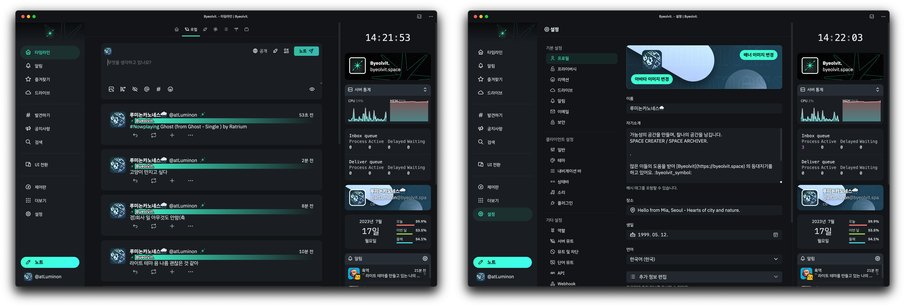
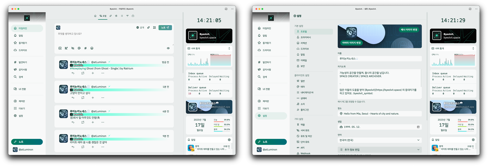

## Byeolvit Noctiluca, Polaris for Misskey.

개인 Misskey 서버 중 하나인 [Byeolvit](https://byeolvit.space)의 기본 라이트 / 다크 테마입니다.

A Basic Light / Dark Theme of [Byeolvit](https://byeolvit.space), a personal server of Misskey.

個人Misskeyサーバーの一つである[Byeolvit](https://byeolvit.space)の基本ライト/ダークテーマです。

### Byeolvit Noctiluca.



> 푸른 별빛이 자아내는 잔향, Byeolvit Noctiluca(별빛 녹틸루카)는 Byeolvit의 기본 다크 모드 테마입니다.

- A blue starry reverberation, Byeolvit Noctiluca is Byeolvit's default dark mode theme.

- 青い星の光が醸し出す残響、Byeolvit Noctiluca(ビョルウィット・ノクティルカ)はByeolvitの基本ダークモードテーマです。

### Byeolvit Polaris.



> 새하얀 별빛의 이정표, Byeolvit Polaris(별빛 폴라리스)는 Byeolvit의 기본 라이트 모드 테마입니다.

- A compass of pure white starlight, Byeolvit Polaris is Byeolvit's default light mode theme.

- 真っ白な星空の道標、Byeolvit Polaris(ビョルウィット・ポラリス)はByeolvitの基本ライトモードテーマです。

## How to Install

1. `설정` → `테마` → `테마 설치`를 엽니다.
2. theme 폴더에 있는 `d-byeolvit-noctiluca.json5`, 또는 `l-byeolvit-polaris`의 코드를 복사한 후 `테마 코드`에 붙여넣고 `설치` 버튼을 누릅니다.
3. 다시 `테마`로 돌아가 설치한 테마를 선택하여 적용합니다.
---
1. Open `Settings` → `Themes` → `Install Theme`.
2. Paste code of `d-byeolvit-noctiluca.json5`, or `l-byeolvit-polaris` to `Theme Code` field, Click to `Install` Button.
3. Go back to `Themes`, Select and apply what you installed.
---
1. `設定` → `テーマ` → `テーマのインストール`を開きます。
2. `theme`フォルダにある`d-byeolvit-noctiluca.json5`、または`l-byeolvit-polaris`のコードをコピーして`テーマコード`に貼り付けて`インストール`ボタンを押します。
3. 再び`テーマ`に戻ってインストールしたテーマを選択して適用します。

## Additional Info (Recommended to Ko-KR)

아래의 CSS 코드를 `일반` → `CSS 사용자화`에 적용하거나 `IBM Plex Sans KR`, `M PLUS 1` 서체를 서버에 적용하여 더 가독성 있는 테마를 즐길 수 있습니다.

You can enjoy a more readable theme by applying the CSS code below to `General` → `Custom CSS` or by applying the `IBM Plex Sans KR`, `M PLUS 1` typeface to your server.

以下のCSSコードを`一般`→`カスタムCSS`に適用したり、`IBM Plex Sans KR`、`M PLUS 1`書体をサーバーに適用して、より読みやすいテーマを楽しむことができます。


```CSS
@import url('https://fonts.googleapis.com/css2?family=IBM+Plex+Sans+KR:wght@400;700&family=M+PLUS+1:wght@400;700&display=swap');

html {
    font-family: 'IBM Plex Sans KR', 'M PLUS 1' ,Roboto,HelveticaNeue,Arial,sans-serif;
}
```